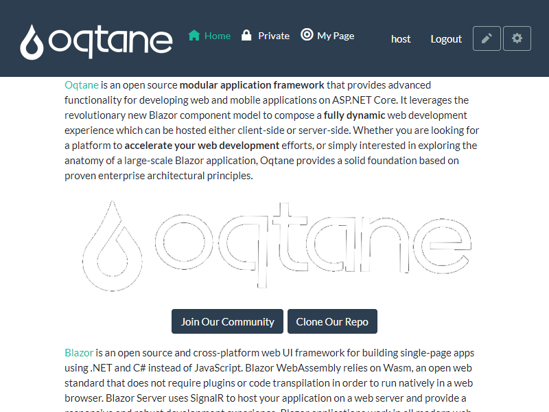

# Template Theme for Oqtane

This is a template theme for [Oqtane](https://www.oqtane.org/). The idea is that you...

1. Download it and build it to verify it works
1. Then replace all the names / IDs etc. so it matches what you want to publish
1. And then you can start customizing as you want to 

## What's included

This is a standard Visual Studio Solution with 3 Projects

1. **[Theme](Theme)** containing only the Theme itself + js/css in a `dist` folder
1. **[Src](Src)** contains Typescript and SASS sources for the `dist` folder
1. **[Build](Build)** containing build-automation and package maker (for installation)
1. Readme files guide you through the structure
1. checklists help you get started

### Theme Parts and Features

1. Parts
    1. 1 Theme with Code-Behind
    1. 2 Layouts: Single-Pane and Multi-Pane
    1. 2 Containers: Default and No-Title
1. Prepared for easy on-boarding to your company and theme-name
    1. The Theme is named `Template` from company `Example` making it easy to replace text fragments
    1. Minimal code/namespaces, so renaming the folder will automatically rename the namespace of your theme
1. Build Optimizations
    1. It builds into a DLL and has various automations to auto-push to your Dev-Oqtane environment incl. assets in a `dist` folder
    1. It also generates a nuget package for distribution (but not tested yet)
1. Checklists for all modifications you need

### Src / Dist Parts and Features

1. Contains standard `package.json` for loading Typescript, Node-Sass etc.
1. On build, compiles the `theme.ts` to the correct `dist` folder
1. On build, compiles Bootstrap, [Bootswatch Flatly](https://bootswatch.com/flatly/) and custom css into one `theme.css` in the correct `dist` folder
1. TypeScript and SASS generate and include SourceMaps for debugging

### Develop and Install project

1. Automation to copy the build to your dev Oqtane installation
1. Stuff to generate a nuget package from your build
1. This depends on the other two projects, so running this will do everything

## Types of Builds / Runs

We've tried to make this as productive as possible. As of now, this is how it works:

1. If you hit F5 (Run) in Debug mode, then the project **Theme** is compiled in debug mode, and everything incl. the `dist` resources are copied to your target.  
You'll see a command-window pop up showing you what happens. 
1. If you Run in Production mode, an nuget-package will also be generated in the **Develop and Install** project in the `packages` folder

## Instructions / Checklists

1. [Installation](https://azing.org/oqtane/r/J8S3eDdR)
1. [Adjust Company and Theme names & Descriptions](https://azing.org/oqtane/r/IjQ147Ef)

## Known Issues

1. Oqtane still loads it's own copy of bootstrap - which is really not good. This is an [ongoing discussion as of 2020-06](https://github.com/oqtane/oqtane.framework/issues/566)
1. This template contains very simple Typescript, for real-world use you probably need Webpack. I'll create a more advanced example soon.
1. Dito for SASS / Bootstrap - this is still a bit too simple, more advanced setup will follow
1. The build automation is currently batch `.cmd` based, I don't really like this, but it works
1. For real-world work, you typically invest most time into css/js development, as the theme itself doesn't change much. For that, it would be better to have a code-watcher which pushes changes continously. 